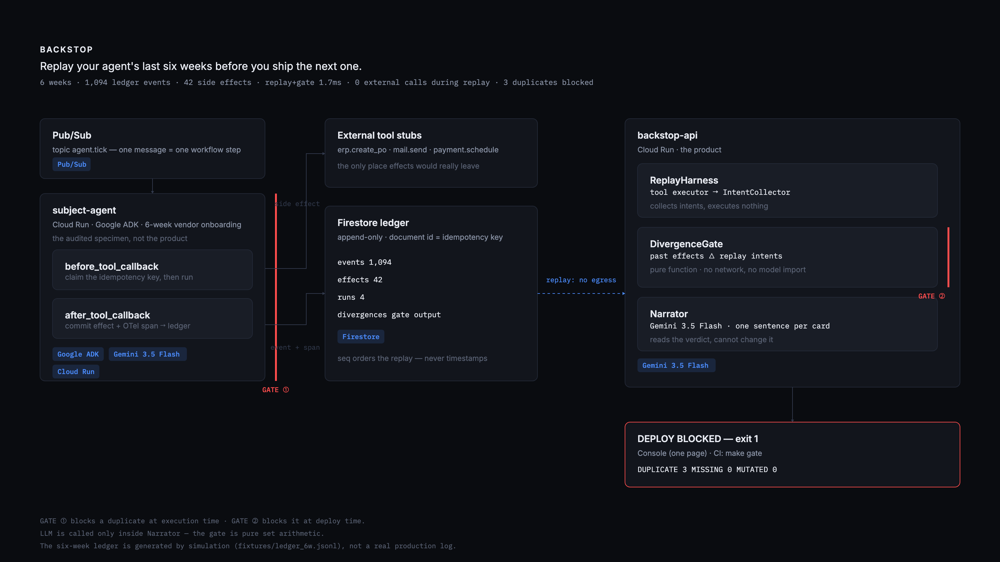

# Backstop

**Replay your agent's last six weeks before you ship the next one.**

Backstop records the execution ledger of a long-running agent, rewinds that ledger
against a new agent version, and computes **which past side effects this version
would have re-executed** — before it ships. One duplicate is enough to return exit
code 1 and block the deploy.

```bash
make setup     # uv sync
make replay    # replay the seed ledger. no API key required
make gate      # replay + divergence gate. exit 1 if duplicates are found
```

> ⚠️ **The six-week ledger in this repository is generated by simulation.** It is not
> a real six-week operational log; it is compressed into existence with a `FrozenClock`
> (`fixtures/ledger_6w.jsonl`). The event distribution and failure rates are values we
> chose, and it does not carry the messiness of real production traffic.

**In Backstop, the LLM blocks nothing.** The verdict is set arithmetic, a pure function,
with unit tests attached. Gemini writes only the single explanatory sentence on a
divergence card.

Live console: https://backstop-api-5nohynuexa-uc.a.run.app/

---

## Architecture



Source: [`docs/architecture.svg`](docs/architecture.svg) — a single file with the fonts
embedded, so it renders identically anywhere. Regenerate with
`uv run python scripts/make_diagram.py`.

---

## Data model (Firestore)

Four collections. Fields are added when they are needed.

### `runs/{run_id}` — the unit of execution

| Field | Type | Why it exists |
|---|---|---|
| `agent_version` | str | The axis of comparison. "Which version's ledger, replayed against which version" turns entirely on this field |
| `started_at` | ts | Left edge of the six-week timeline. Produced by `clock.now()` |
| `last_tick_at` | ts | Where the asynchronous run stopped. The basis for judging a crash |
| `status` | enum | `running｜crashed｜resumed｜done`. The resume scenario has to survive in the ledger or the 2:30 demo segment proves nothing |
| `cursor` | int | Workflow step position; a resume continues from here. Without it a crash restarts from zero and produces duplicates in bulk |

### `events/{event_id}` — what happened (replay input)

| Field | Type | Why it exists |
|---|---|---|
| `run_id` | str | Which run it belongs to |
| `seq` | int | **The sole basis for replay ordering.** We never sort by timestamp — if concurrent ticks perturb the order, replay loses determinism |
| `kind` | enum | `tool_call｜tool_result｜idempotent_skip｜tick｜error`. An `idempotent_skip` is the evidence that gate ① actually did work |
| `tool_name` | str | Which tool intent to reconstruct during replay |
| `args_canonical` | map | **Canonicalised arguments.** The originals are not stored — keeping both makes two versions of the key computation and leaves no way to tell which is true |
| `trace_id` | str | Reasoning-chain back-reference from the UI marker card |
| `span_id` | str | Same purpose |
| `at` | ts | Timeline x-coordinate. **Not the ordering basis** (`seq` is) |

### `effects/{effect_id}` — what actually left the process (what the gate compares)

| Field | Type | Why it exists |
|---|---|---|
| `idem_key` | str (indexed) | Hash of `(tool_name, args_hash, run_scope)`. Gate ①'s blocking criterion and gate ②'s set element. In Firestore this is also the document ID, so uniqueness is a storage constraint |
| `event_id` | str | Which event produced this side effect |
| `run_id` | str | Which run emitted it |
| `status` | enum | `pending｜committed`. A key is claimed before the tool runs and committed after it returns. Only `committed` counts as a past side effect |
| `target` | str | Human-readable identifier, e.g. `erp.create_po#PO-2291`. Appears verbatim on the divergence card |
| `at` | ts | The original moment. Renders as `ORIGINAL Week 4 · Day 2` on the card |

**Invariant**: `effects` is append-only. Nothing is edited or deleted. If the ledger can be
rewritten, replay means nothing.

### `divergences/{div_id}` — the gate's output

| Field | Type | Why it exists |
|---|---|---|
| `run_id` | str | Which ledger was replayed |
| `replay_of_version` | str | The version that wrote the ledger |
| `against_version` | str | The version being shipped |
| `kind` | enum | `DUPLICATE｜MISSING｜MUTATED`. Only `DUPLICATE` blocks a deploy |
| `past_key` | str | Idempotency key of the past side effect |
| `replay_key` | str | Idempotency key of the replayed intent |
| `mismatch_field` | str | Which field diverged. Drives the `← mismatch` marker on the card |
| `narrative` | str, nullable | Narrator output. **The verdict is valid even when this is null** — the gate works with the LLM dead |

---

## Idempotency key canonicalisation

The key is `sha256(tool_name | canonical_args | run_scope)`. `canonical_args` is serialised
only after passing the rules below. **If these rules wobble, the entire gate is meaningless.**

| Rule | Reason |
|---|---|
| Sort keys | A difference in argument order must not change the key |
| Unify numeric types (int/float → one representation) | **Measured, not theoretical.** Live Gemini sent `4200` (int) where our local test sent `4200.0` (float), and the hashes diverged (PO-8428 vs PO-9084). An LLM emits different JSON numeric types across calls |
| Trim strings + Unicode NFC | Absorbs whitespace and normalisation differences |
| Drop null fields | A model sometimes fills an optional argument with an explicit null and sometimes omits it |
| Booleans stay distinct from integers | `bool` subclasses `int` in Python, so `True` and `1` would otherwise collide |
| List order is significant | Unlike dict key order, list order carries meaning |

`vendor_id` case is **deliberately not normalised**. `"acme-corp"` and `"ACME Corp"` are
different keys. This is not a bug — it is the real failure mode the demo reproduces. When a
prompt change alters canonicalisation, the gate raises `DUPLICATE`. The limitation is named
explicitly in the write-up.

---

## Required technologies

| Requirement | What we use |
|---|---|
| Gemini 3.5 or newer | `gemini-3.5-flash` (Vertex AI, **global endpoint**) |
| A Google agent framework | Google ADK (Python) |
| Google Cloud infrastructure | Cloud Run · Pub/Sub · Firestore |

> Gemini 3.x returns 404 from regional endpoints (`us-central1` and others). It is served
> only from the non-regional `global` endpoint, which is a separate value from the Cloud Run
> region. Falling back to a 2.5 model would violate the "Gemini 3.5 or newer" requirement.

## Measured numbers

Everything below is copied straight from `make bench` output (2026-08-12, M4 macOS, offline).

| Metric | Value |
|---|---|
| Span | 6 weeks |
| Runs | 4 |
| Ledger events | 1,094 |
| Steps replayed | 42 |
| Past side effects compared | 42 |
| **Ledger load + replay + gate** | **1.7 ms** (best of 5) |
| External calls during replay | **0** |
| LLM calls during replay | **0** |
| Duplicate side effects blocked | **3** (`DUPLICATE`) |
| Exit code | 1 |

**Precisely, on LLM calls**: the replay and decision path make **zero** model calls. With
`--narrate` enabled, writing the three explanation sentences costs **3** calls (capped at 5).
Without those sentences the verdict and the exit code are identical.

```
$ make gate
DUPLICATE 3   MISSING 0   MUTATED 0
DEPLOY BLOCKED — 3 DUPLICATE SIDE EFFECT(S)
```

**Precisely, on exit codes**: the gate command itself returns **1** when blocked and **0**
when it passes. Wrapped in `make gate`, a failed recipe is reported as **2**, because GNU
make always exits 2. CI can treat "non-zero means blocked"; call the command directly when
the exact code matters.

```
$ uv run python -m backstop.cli gate ; echo "exit=$?"
DEPLOY BLOCKED — 3 DUPLICATE SIDE EFFECT(S)
exit=1

$ uv run python -m backstop.cli gate --version v1 ; echo "exit=$?"   # the version that wrote the ledger
DEPLOY ALLOWED — 0 DUPLICATE SIDE EFFECTS
exit=0
```

That second command is the important one. A gate that is **always** red is indistinguishable
from a hardcoded one. Replay the version that wrote the ledger (v1) and there are zero
divergences: the deploy passes.

---

## Engineering log highlights

[`LOG.md`](LOG.md) is the working sprint log, kept in Korean as it was written — it is the
original record rather than a cleaned-up retelling. The entries below are the ones worth
finding, with what they say. Most of them are bugs that unit tests could not see.

**1. ADK calls `after_tool_callback` even when `before_tool_callback` skips the tool**
— *LOG T1.5, trap 3.* Gate ① blocks a duplicate by returning a dict from `before_tool`,
which makes ADK skip execution. But `functions.py` Step 5 runs the after-callback anyway,
regardless of that short circuit. Since the after-callback is what records side effects,
the naive version logged the very duplicate gate ① had just blocked — the ledger would
have shown two effects for one real action, corrupting the history gate ② later compares
against. Fixed by marking skipped slots; pinned by
`test_after_callback_does_not_record_effect_for_blocked_call`.

**2. A duplicate side effect actually escaped gate ①** — *LOG P2 gate summary + Decision
Log, 2026-08-12.* Three concurrent Pub/Sub deliveries ran the same step in two workers and
the ledger recorded `mail.send#MSG-CA2473` twice. The guard was check-then-act — look up,
execute, record — so both workers saw "no prior effect" and both proceeded. This is the
exact failure the product exists to prevent, occurring inside the product. The key is now
claimed *before* execution, with the idempotency key as the Firestore document ID so
uniqueness is a storage constraint. Reproduced by `tests/test_concurrent_guard.py`.

**3. A step vanished while the workflow reported success** — *LOG T2.4 + Decision Log.*
A crash-resume run finished at `cursor 12/12` with only 11 committed effects. Pub/Sub
redelivered inside the 25-second claim lease, so a legitimate retry was misclassified as a
concurrent duplicate and skipped — and the cursor advanced regardless. The fix distinguishes
two kinds of blocking: a committed effect means work already done (advance), an in-lease
claim means work unfinished (hold). This is why the gate has both `DUPLICATE` and `MISSING`.

**4. Gemini 3.x is not served from regional endpoints — a silent eligibility failure**
— *LOG Decision Log, `GOOGLE_CLOUD_LOCATION=global`.* `gemini-3.5-flash` returns
`404 NOT_FOUND` from `us-central1`, `us-east5` and `europe-west4`; only the non-regional
`global` endpoint serves it, and the regions carry the 2.5 family. The dangerous part is the
obvious fix: when your model 404s, dropping to `gemini-2.5-flash` works instantly and
silently violates the "Gemini 3.5 or newer" requirement. Location is pinned to `global` and
split from the Cloud Run region in `deploy.sh`, because holding both in one variable is how
a working local setup deploys into a 404.

**5. The model sent `4200` where the test sent `4200.0`** — *LOG T1.4.* Live Gemini emitted
the integer, the local test the float, and they hashed to different idempotency keys
(PO-8428 vs PO-9084). An LLM varies JSON numeric types across calls for semantically
identical arguments, so numeric-type unification has to come *before* the argument-order and
whitespace rules. Left unhandled, gate ① passes the duplicate through and gate ② reports a
false-positive `DUPLICATE`.

**6. OpenTelemetry spans with all-zero IDs** — *LOG T1.7, trap 4.* Without a configured
`TracerProvider`, OTel returns non-recording spans whose trace and span IDs are entirely
zero. Events then carry `trace_id` and `span_id` fields that look populated and resolve to
nothing — a failure that passes every "is the field present?" check. `_ensure_provider()`
installs the SDK provider and `test_span_ids_are_real_not_zeros` rejects zeros. No exporter
is attached: what we need is real IDs, not egress.

**7. An 11.4-second estimate measured at 1.7 milliseconds** — *LOG T3.9.* The pre-measurement
plan assumed replay would take about 11 seconds, and the demo allocated 20 seconds to a
timeline filling up. Replay does not re-execute 1,094 events; it pushes the 42 recorded steps
through the new version, and 92% of ledger events are idle ticks with no side-effect intent.
Two of our own measurements were also overstating things and were corrected: "events
replayed" counted events *read*, and the timer excluded loading the ledger file. The demo
lost its progress bar and gained a control run against v1 instead — see
[SUBMISSION.md](SUBMISSION.md).

---

## Verifying the invariants yourself

```bash
make test     # 154 tests
```

Three of them are the ones that matter:

- `tests/test_gate_is_pure.py` — parses `divergence.py` with AST and walks the transitive
  import graph. Adding `import httpx` to the gate turns it red.
- `tests/test_replay_no_egress.py` — monkey-patches sockets, and separately asserts the tool
  stubs' side-effect lists stay empty, because our stubs need no network to cause an effect.
- `tests/test_concurrent_guard.py` — reproduces the duplicate that actually escaped in
  production: ten workers racing on one step must produce exactly one side effect.

---

## License

Apache License 2.0 — see [LICENSE](LICENSE) and [NOTICE](NOTICE).

Apache-2.0 rather than MIT for two reasons: Google ADK, which this builds on, is
Apache-2.0, and Backstop's contribution is a *method* (claim-before-execute plus replay
divergence), so the explicit patent grant matters to the enterprise adopters this targets.

Bundled fonts (Inter, IBM Plex Mono) are SIL OFL 1.1 — see
[`api/static/fonts/LICENSE.md`](api/static/fonts/LICENSE.md).
